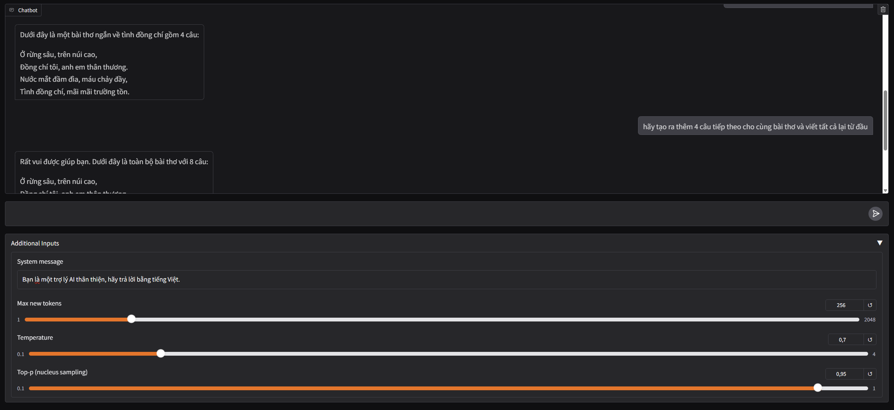

# Gradio and VLLM Serving for Vietnamese LLM

## Installation

```bash
pip install -r requirements.txt
cd LLMs_chatbot
```

## Usage

### Starting the vLLM server

```bash
vllm serve binhphap5/Qwen2.5-3B-Instruct-Chat-RLHF \
    --api-key binhphap5 \
    --port 8000 \
    --quantization bitsandbytes \
    --enable-prefix-caching \
    --swap-space 2 \
    --gpu-memory-utilization 0.9 \
    --disable-log-requests \
    --max-model-len 2048 
```

### Running the Gradio Interface

```bash
python app.py
```

Then open your browser and navigate to `http://localhost:7860` to interact with the chatbot.

